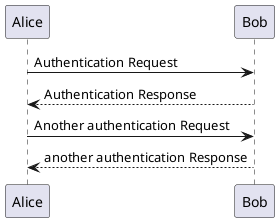

<!-- {docsify-updated} -->

# 编写测试

## 表情

[表情链接](https://www.webfx.com/tools/emoji-cheat-sheet/)

## tabs

<!-- tabs:start -->

#### **English**

Hello!

#### **French**

Bonjour!

#### **Italian**

Ciao!

<!-- tabs:end -->

## panel

<!-- panels:start -->
<!-- div:title-panel -->

  (...) - Awesome title

<!-- div:left-panel -->

  (...) - Awesome explanation

<!-- div:right-panel -->

  (...) - Awesome example

<!-- div:left-panel -->

  (...) - Awesome example11111

<!-- div:right-panel -->

  (...) - Awesome example11111

<!-- panels:end -->

## plantuml

## 警告提示

> [!NOTE]
> An alert of type 'note' using global style 'callout'.

> [!TIP]
> An alert of type 'tip' using global style 'callout'.

> [!WARNING]
> An alert of type 'warning' using global style 'callout'.

> [!ATTENTION]
> An alert of type 'attention' using global style 'callout'.

## 表格

| Left Align | Center Align | Right Align | Non&#8209;Breaking&nbsp;Header |
| ---------- |:------------:| -----------:| ------------------------------ |
| A1         | A2           | A3          | A4                             |
| B1         | B2           | B3          | B4                             |
| C1         | C2           | C3          | C4                             |

## 键盘

<kbd>&uarr;</kbd> Arrow Up

<kbd>&darr;</kbd> Arrow Down

<kbd>&larr;</kbd> Arrow Left

<kbd>&rarr;</kbd> Arrow Right

<kbd>&#8682;</kbd> Caps Lock

<kbd>&#8984;</kbd> Command

<kbd>&#8963;</kbd> Control

<kbd>&#9003;</kbd> Delete

<kbd>&#8998;</kbd> Delete (Forward)

<kbd>&#8600;</kbd> End

<kbd>&#8996;</kbd> Enter

<kbd>&#9099;</kbd> Escape

<kbd>&#8598;</kbd> Home

<kbd>&#8670;</kbd> Page Up

<kbd>&#8671;</kbd> Page Down

<kbd>&#8997;</kbd> Option, Alt

<kbd>&#8629;</kbd> Return

<kbd>&#8679;</kbd> Shift

<kbd>&#9251;</kbd> Space

<kbd>&#8677;</kbd> Tab

<kbd>&#8676;</kbd> Tab + Shift

## 文本

Body text

**Bold text**

*Italic text*

~~Strikethrough~~

<mark>Marked text</mark>

<pre>Preformatted text</pre>

<small>Small Text</small>

This is subscript

This is superscript